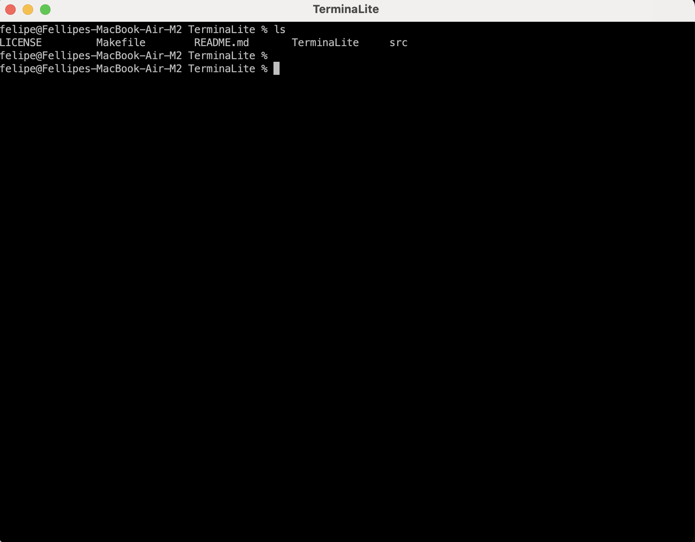
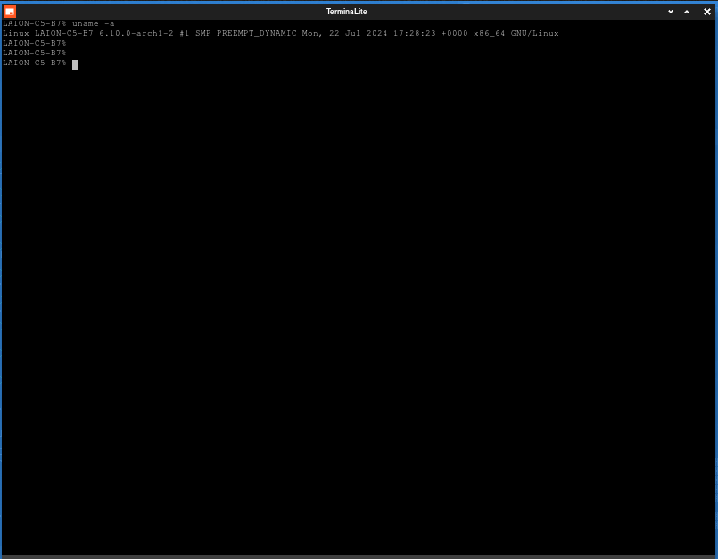

# TerminaLite
A lightweight and versatile terminal emulator for Linux and macOS built with GTK3 and VTE.

TerminaLite* is a lightweight and versatile terminal emulator designed for both Linux and macOS platforms. Built using GTK3 and VTE, TerminaLite provides a modern, sleek interface with essential features for all your terminal needs. Whether you're a developer, system administrator, or a casual user, TerminaLite aims to deliver a seamless terminal experience with fast performance and reliable functionality. This project is perfect for those who need a simple yet powerful terminal emulator that integrates well with their workflow and enhances their productivity.

<sub>* This is currently an experimental phase where the primary focus is on making the system functional and establishing a practical and logical pathway that aligns with both my vision and the project's goals. It might contain errors, bugs, etc. Many other non-core elements of the project are considered secondary.</sub>


[](https://github.com/Naereen/badges/)


[](https://opensource.org/licenses/BSD-3-Clause)

<!--
[](http://perso.crans.org/besson/LICENSE.html)
-->

[](https://www.vim.org)
[](https://code.visualstudio.com/)

#

#### Screenshots*

[](#)


#### Screenshot macOS

<p align="center">
  
</p>


#### Screenshot Linux (Arch)

<p align="center">
  
</p>


<sub>* This project is still under development. Future updates may include changes to the GUI, and screenshots may not accurately reflect the final design.</sub>

#

#### Installation (Arch Linux)*
#### Via AUR using YAY

[](https://aur.archlinux.org/packages/termlite)

<!-- 
[](https://aur.archlinux.org/packages/termlite)
-->

<!-- 
https://aur.archlinux.org/packages/termlite
-->

TerminaLite (termlite on AUR) is available on AUR (Arch User Repository), and it can be installed using the `yay` package manager. Follow the steps below to install:

1. Make sure you have `yay` installed. If not, you can install it with the following command:
   
   ```
   sudo pacman -S yay
   ```
   Once yay is installed, you can install it by running the following command:
   
   ```
   yay -S termlite
   ```
This command will automatically fetch the package from AUR and handle the installation process for you.
You can find TerminaLite App in your program menu!


#

#### Compile 

```
gcc -o TerminaLite src/terminalite.c `pkg-config --cflags --libs gtk+-3.0 vte-2.91`
```

#### Dependencies

- GTK+ 3:

Description: A toolkit for creating graphical user interfaces.
Library: gtk+-3.0
Usage: Required for creating the main application window and other UI elements.

- VTE:

Description: Provides terminal emulation capabilities within GTK+ applications.
Library: vte-2.91
Usage: Required for embedding a terminal emulator in your GTK+ application.

#


#### 🌟 Contact the Creator and Engineer Behind This Project


👨‍💻 **Felipe Alfonso González**  
📧 Email: [f.alfonso@res-ear.ch](mailto:f.alfonso@res-ear.ch)  
🐦 x (Twitter): [@felipealfonsog](https://twitter.com/felipealfonsog)  
🔗 GitHub: [felipealfonsog](https://github.com/felipealfonsog)  
📄 License: BSD 3-Clause  


#

#### 🤝 Support and Contributions

If you find this project helpful and would like to support its development, there are several ways you can contribute:

- **Code Contributions**: If you're a developer, you can contribute by submitting pull requests with bug fixes, new features, or improvements. Feel free to fork the project (development branch) and create your own branch to work on.
- **Bug Reports and Feedback**: If you encounter any issues or have suggestions for improvement, please open an issue on the project's GitHub repository. Your feedback is valuable in making the project better.
- **Documentation**: Improving the documentation is always appreciated. If you find any gaps or have suggestions to enhance the project's documentation, please let me know.

[](https://www.buymeacoffee.com/felipealfonsog)
[](https://www.paypal.me/felipealfonsog)
[](https://github.com/sponsors/felipealfonsog)

Your support and contributions are greatly appreciated! Thank you for your help in making this project better. If you need to mail me, this is the way: f.alfonso@res-ear.ch (I'm Felipe, the Computer Science Engineer behind this idea. Cheers!)


#### 📄 License

This project is licensed under the [BSD 3-Clause License](LICENSE). It will have some restrictions, ask about it.
